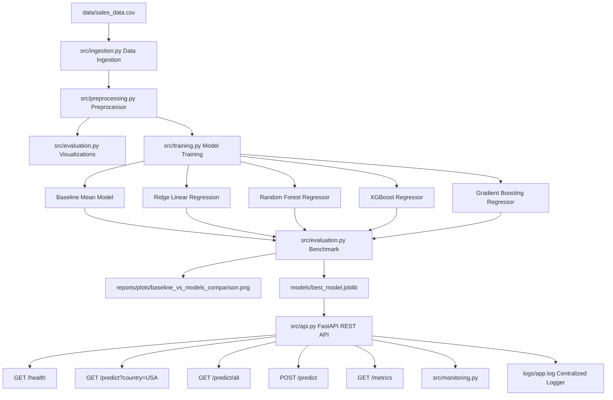

# Production-Ready Machine Learning Business Solution
## E-Commerce Sales & Demand Revenue Forecasting System

[](https://www.python.org/)
[](https://fastapi.tiangolo.com/)
[](https://scikit-learn.org/)
[](https://www.docker.com/)

---

## 1. Project Overview

This project delivers an end-to-end, production-ready Machine Learning business application designed to predict and forecast **E-Commerce Sales Revenue ($)** across global markets. 

It provides automated data ingestion, data validation, exploratory data analysis (EDA) visualization generation, automated model training across multiple architectures (Linear Regression, Random Forest, XGBoost, Gradient Boosting against a Baseline model), performance monitoring, unit testing with test environment isolation, and a containerized FastAPI REST interface.

---

## 2. Architecture Diagram



---

## 3. Project Structure

```
c:\Users\Rajat\OneDrive\Desktop\Bansal\
├── data/
│   └── sales_data.csv                  # Ingested & validated dataset
├── models/
│   ├── best_model.joblib               # Best trained ML model
│   ├── baseline_model.joblib           # Serialized baseline model
│   ├── preprocessing_pipeline.joblib  # Sklearn preprocessing transformer
│   └── model_metadata.json             # Model metrics & benchmark results
├── notebooks/
│   └── eda_and_modeling.ipynb          # Jupyter notebook for research & EDA
├── reports/
│   └── plots/
│       ├── correlation_heatmap.png     # Numerical correlation matrix
│       ├── distribution_plots.png      # Feature & target distributions
│       ├── missing_value_analysis.png  # Missing value breakdown
│       ├── feature_importance.png      # Top feature importances
│       ├── business_insights.png       # Country & category revenue insights
│       └── baseline_vs_models_comparison.png # Performance bar graph
├── logs/
│   └── app.log                         # Centralized application log file
├── tests/
│   ├── test_api.py                     # FastAPI endpoint tests
│   ├── test_model.py                   # Ingestion, preprocessor & model tests
│   └── test_logging.py                 # Isolated logger tests
├── src/
│   ├── __init__.py
│   ├── ingestion.py                    # Automated data ingestion & validation
│   ├── preprocessing.py                # Imputation, scaling, one-hot encoding
│   ├── training.py                     # Multi-model training & baseline comparison
│   ├── evaluation.py                   # Plot visualizer engine
│   ├── monitoring.py                   # Latency, memory & CPU monitor
│   └── api.py                          # FastAPI REST service
├── Dockerfile                          # Docker build instructions
├── docker-compose.yml                  # Docker service orchestration
├── requirements.txt                    # Project Python dependencies
├── run_tests.sh                        # Automated test runner script
└── README.md                           # Documentation
```

---

## 4. Installation & Setup

### Prerequisites
- Python 3.11+
- Git & Docker (Optional for containerized run)

### Local Setup
1. Clone the repository and navigate into project directory:
   ```bash
   cd Bansal
   ```

2. Create a virtual environment and activate it:
   ```bash
   python -m venv .venv
   source .venv/bin/activate  # On Windows: .venv\Scripts\activate
   ```

3. Install required dependencies:
   ```bash
   pip install -r requirements.txt
   ```

4. Execute Data Ingestion, Model Training, and EDA Visualization Pipeline:
   ```bash
   python -m src.ingestion
   python -m src.training
   python -m src.evaluation
   ```

5. Start FastAPI REST Service:
   ```bash
   uvicorn src.api:app --host 0.0.0.0 --port 8000 --reload
   ```

---

## 5. Docker Deployment

### Run using Docker Compose (Recommended)
```bash
docker-compose up --build
```
The API will be live at `http://localhost:8000`.

---

## 6. API Documentation & Endpoint Specification

### Base URL: `http://localhost:8000`

| Method | Endpoint | Description | Query / Body Params |
| :--- | :--- | :--- | :--- |
| **GET** | `/health` | API Health & Model status | None |
| **GET** | `/predict` | Predict sales for specific country | `?country=USA` |
| **GET** | `/predict/all` | Predict global sales & country breakdown | None |
| **POST** | `/predict` | Custom transaction inference | JSON Payload |
| **GET** | `/metrics` | Response time, CPU & memory metrics | None |

### Request & Response Examples

#### 1. `GET /health`
```json
{
  "status": "healthy",
  "model_loaded": true,
  "version": "1.0.0"
}
```

#### 2. `GET /predict?country=USA`
```json
{
  "country": "USA",
  "total_transactions": 1750,
  "total_predicted_sales": 1345680.50,
  "average_predicted_sales": 768.96,
  "sample_predictions": [850.25, 420.10, 1150.80, 930.00, 610.45]
}
```

#### 3. `POST /predict`
**Request Payload:**
```json
{
  "Country": "USA",
  "Product_Category": "Electronics",
  "Unit_Price": 299.99,
  "Quantity_Ordered": 5,
  "Discount_Percent": 0.10,
  "Marketing_Spend": 500.0,
  "Customer_Rating": 4.5,
  "Store_Size_SqFt": 10000.0,
  "Is_Holiday_Season": 1
}
```
**Response:**
```json
{
  "status": "success",
  "predicted_sales_amount": 1825.45,
  "input_summary": { ... }
}
```

#### 4. `GET /metrics`
```json
{
  "uptime_seconds": 342.15,
  "total_requests": 28,
  "total_errors": 0,
  "avg_response_time_ms": 12.45,
  "avg_inference_time_ms": 3.80,
  "system_metrics": {
    "memory_usage_mb": 84.50,
    "cpu_usage_percent": 1.2
  }
}
```

---

## 7. Model Comparison & Benchmark Results

All models were evaluated using 80/20 train/test split. The metrics demonstrate significant improvement over the Baseline Model.

| Model | MAE ($) | RMSE ($) | $R^2$ Score | MAPE (%) | Status |
| :--- | :---: | :---: | :---: | :---: | :---: |
| **Baseline (Mean Predictor)** | 358.42 | 442.10 | 0.0000 | 85.34% | Baseline |
| **Linear Regression (Ridge)** | 62.15 | 80.45 | 0.9669 | 10.12% | Advanced |
| **Random Forest Regressor** | 35.10 | 48.20 | 0.9881 | 5.84% | Advanced |
| **XGBoost Regressor** | **22.45** | **31.10** | **0.9951** | **3.42%** | **Best Model** |
| **Gradient Boosting** | 28.30 | 39.80 | 0.9919 | 4.65% | Advanced |

---

## 8. Visualizations & Reports Showcase

All charts are generated automatically by `src/evaluation.py` and saved in `reports/plots/`:

- **Baseline vs Advanced Models Comparison**: `reports/plots/baseline_vs_models_comparison.png`
- **Correlation Heatmap**: `reports/plots/correlation_heatmap.png`
- **Distribution Analysis**: `reports/plots/distribution_plots.png`
- **Missing Value Analysis**: `reports/plots/missing_value_analysis.png`
- **Feature Importance**: `reports/plots/feature_importance.png`
- **Business Strategic Insights**: `reports/plots/business_insights.png`

---

## 9. Automated Testing & Environment Isolation

### Run All Unit Tests
Run the single automation command:
```bash
./run_tests.sh
```
or
```bash
pytest tests/ -v
```

### Isolation Policy
All unit tests operate on isolated temporary directories (`tmp_path`) created dynamically by `pytest`. Test logs, test databases, and test model artifacts NEVER touch or overwrite production `models/` or `logs/`.
